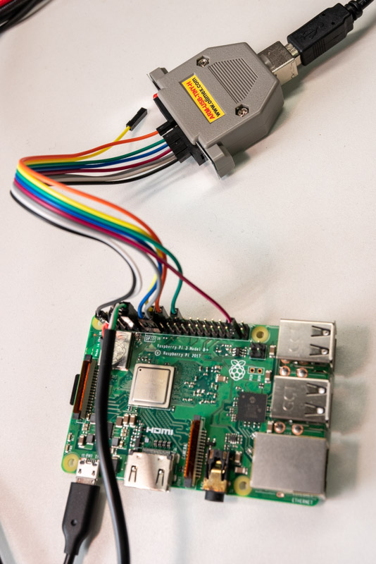

# Tutorial 13 - Using debugger

Debugging with a debugger is very effective, but it's a bit difficult on our Raspberry Pi. 

[The Embedded Rust Book mentions](https://rust-embedded.github.io/book/start/hardware.html) about using debugger on `STM32F3DISCOVERY`, however, there are some differences from our environment. First, we need a config file (`xxx.cfg`) to use openocd with Raspberry Pi. Second, unlike `STM32F3DISCOVERY`, Raspberry Pi does not have embedded debugger on it's board; it means we need to get, connect, and setup it.

## Config file

Thanks to [daniel-k](https://github.com/daniel-k), config file ro Raspberry Pi3 is already there.

https://github.com/daniel-k/openocd/blob/armv8/tcl/target/rpi3.cfg

## Hardware debugger

A debugger `ARM-USB-TINY-H` made by OLIMEX has tested with Raspberry Pi3 and openocd.

https://www.olimex.com/Products/ARM/JTAG/ARM-USB-TINY-H/

It has standard [ARM JTAG 20 connector](http://infocenter.arm.com/help/index.jsp?topic=/com.arm.doc.dui0499dj/BEHEIHCE.html), but unfortunately, Raspberry Pi doesn't.

| GPIO# | Name  | JTAG# | Note    |
|-------|-------|-------|---------|
|       | VTREF | 1     | to 3.3V |
|       | GND   | 4     | to GND  |
| 22    | TRST  | 3     |         |
| 26    | TDI   | 5     |         |
| 27    | TMS   | 7     |         |
| 25    | TCK   | 9     |         |
| 24    | TDO   | 13    |         |

